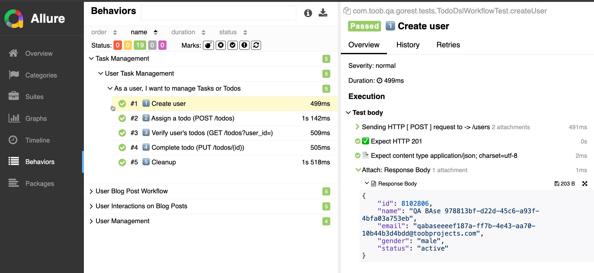

# 🚀 QA GoRest Automation – Showcase with QABase

> **Highlights:** End-to-end REST API automation using the [QABase](https://github.com/toobprojects/qabase-framework) framework (v1.3.0).  
> **Scope:** Demonstrates how to use the QABase **Core** module for fluent REST testing with minimal setup.

---

## 📖 About This Project
This repository is a **showcase project** for **REST API automation testing** using **QABase**.  
It demonstrates:
- ✅ Minimal Maven setup with **QABase Core** as the parent.  
- ✅ Fluent **REST DSL** via `HttpSupport.expect()` for assertions.  
- ✅ Convenient **RestClient** wrapper for HTTP calls.  
- ✅ **Allure reports** auto-generated from tests for traceability.  

> This project focuses on **REST API testing**.  
> A separate showcase for **Web UI testing** with QABase WebUI (Selenide) will follow soon.

---

## ⚙️ Prerequisites
- ☕ Java **17**  
- 📦 Apache Maven **3.8+**  

---

## 🔑 Authentication Setup
To run these tests, you will need a valid **GoRest API Token**.  
Generate one from the [GoRest API website](https://gorest.co.in/), then expose it as an environment variable:

```bash
export GOREST_TOKEN=your_generated_token_here
```

This token is automatically picked up by the test cases via the `GOREST_TOKEN` environment variable.

---

## 📦 Minimal POM Setup
To get started with QABase, you only need:

```xml
<parent>
    <groupId>io.github.toobprojects</groupId>
    <artifactId>qabase-framework</artifactId>
    <version>2.0.0</version>
    <relativePath/> <!-- fetch from repository -->
</parent>

<dependencies>
    <!-- QABase REST DSL -->
    <dependency>
        <groupId>io.github.toobprojects</groupId>
        <artifactId>qabase-rest</artifactId>
    </dependency>
</dependencies>

<build>
    <!-- Ensure Java tests are included -->
    <sourceDirectory>src/main/java</sourceDirectory>
    <testSourceDirectory>src/test/java</testSourceDirectory>
</build>
```

## 🛠️ QABase Rest Configuration

Project config (YAML) used by the showcase:

```yaml
qabase:
  rest:
    base-url: "https://gorest.co.in/public/v2"
```

> Values can be overridden via system props or env if needed.


👉 That’s it! This minimal configuration ensures:
- QABase parent manages plugins & dependencies.  
- REST DSL and helpers are available out of the box.  
- Allure reporting and test lifecycle wiring are pre-configured.  

(Optional) Add **Lombok** if you prefer boilerplate-free Java (not required for QABase).

---

## 📝 Example Tests

### Create User
```java
Response resp = RestClient.post("/users", TestDataFactory.randomUser());
user = HttpSupport.expect(resp)
        .created()
        .contentType(RestModuleConstants.DEFAULT_CONTENT_TYPE)
        .attach()
        .as(User.class);

assertNotNull(user.getId(), "New user must have an id");
```

### Fetch User
```java
Response resp = RestClient.get("/users/" + user.getId());
HttpSupport.expect(resp)
        .ok()
        .contentType(RestModuleConstants.DEFAULT_CONTENT_TYPE)
        .fieldEq("id", Math.toIntExact(user.getId()))
        .attach();
```

👉 These tests use the **QABase REST DSL** to validate status codes, content types, fields, and even SLA timing.

---

## 📊 Reporting with Allure
After running tests, QABase automatically generates **Allure Reports** under `target/allure-results`.

### Generate the report:

```bash
# 1) Property-based activation (auto-activates the profile)
mvn clean verify -Dallure.reports=true

# 2) Profile by ID (sets the same property under the hood)
mvn clean verify -Pallure-reports
```

### Serve the report locally:

```bash
mvn allure:serve
```

Sample report (screenshot):  


---

## 🔑 Key Takeaways
- Minimal setup with **QABase Core** → parent POM does the heavy lifting.  
- Fluent REST assertions via `HttpSupport.expect()`.  
- Auto-generated **Allure reporting** for beautiful test insights.  
- Java-friendly (works great with **Lombok** if you prefer).  

---

## 🌍 Next Steps
- [ ] Showcase project for **QABase WebUI** (Selenide-based Web UI automation).  
- [ ] Example repo with **QABase as a BOM** instead of a parent.  

---

👨‍💻 Built with ❤️ by **[TOOB Projects](https://github.com/toobprojects)** to simplify and accelerate **QA Automation** on the JVM.
